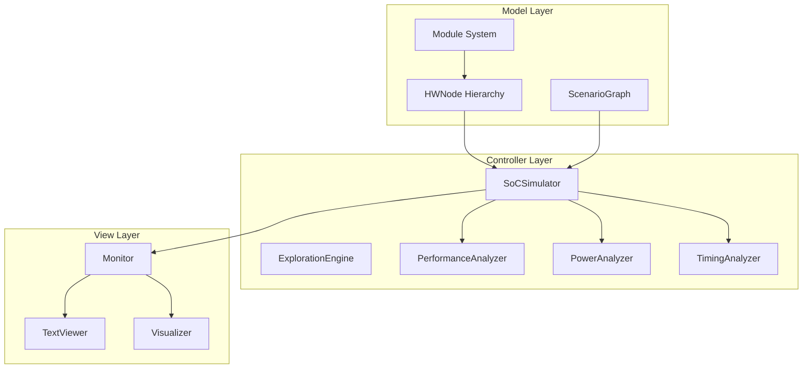
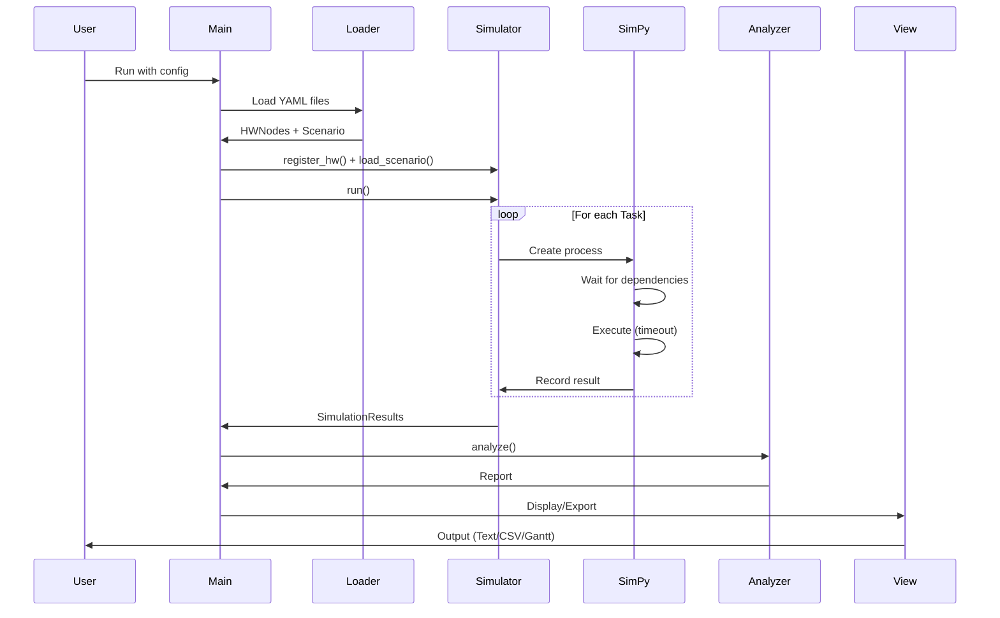
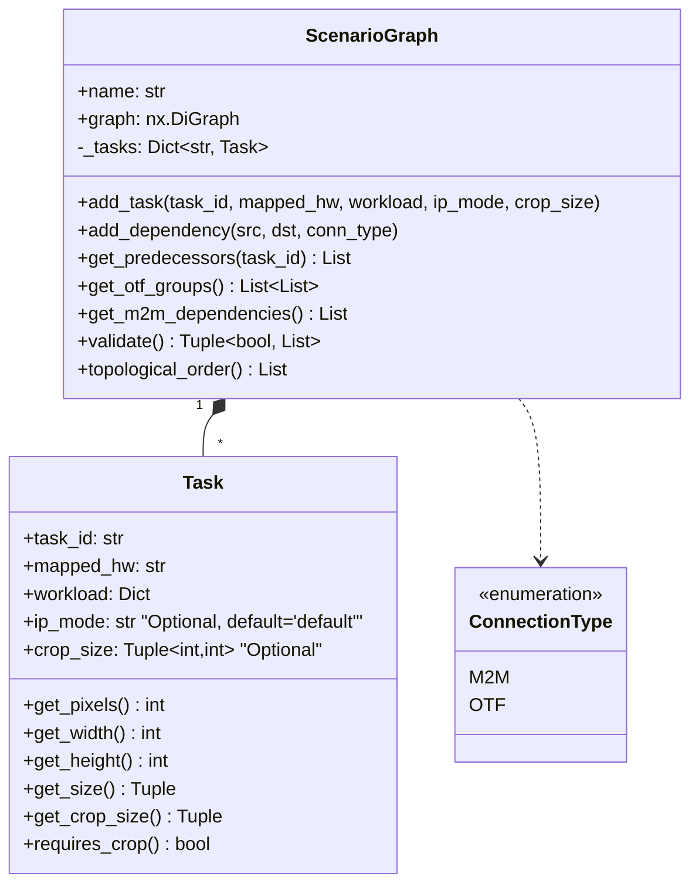
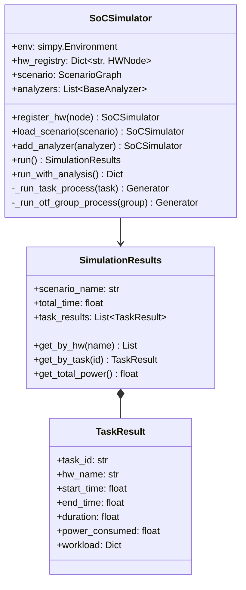
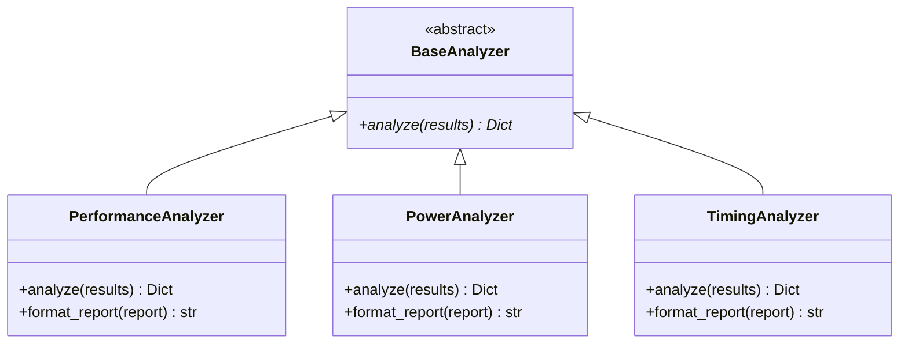
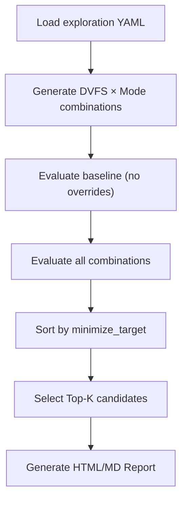
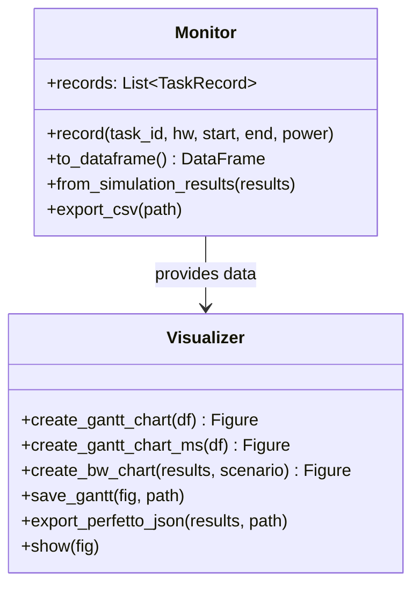

# SoC Multimedia Architecture Simulator - Design Document

## 1. Overview

### 1.1 Purpose

Android 기반 SoC의 Multimedia IP(Camera, Video, Display, GPU, NPU 등)들의 동작을 시뮬레이션하여 **Performance, Latency, Power**를 예측하는 Discrete Event Simulator입니다.

### 1.2 Key Design Goals

| Goal | Description |
|------|-------------|
| **Event-Driven** | SimPy 기반의 이벤트 중심 시뮬레이션 |
| **DAG-Based Modeling** | NetworkX를 활용한 Task 의존성 그래프 |
| **OTF/M2M Support** | 파이프라인(OTF)과 메모리 기반(M2M) 데이터 흐름 지원 |
| **Extensibility** | MVC 패턴으로 확장성 확보 |
| **Modularity** | HW Config와 Scenario Config 분리 |

### 1.3 Technology Stack

```
┌─────────────────────────────────────────────────────────┐
│                    Application Layer                     │
├─────────────────────────────────────────────────────────┤
│  main.py │ YAML Loader │ CLI Interface                  │
├─────────────────────────────────────────────────────────┤
│                      MVC Architecture                    │
├──────────────┬──────────────────┬───────────────────────┤
│    Model     │    Controller    │         View          │
│  (hw_nodes)  │   (simulator)    │    (text_view)        │
│  (modules)   │   (analyzers)    │    (visualizer)       │
│  (scenario)  │                  │    (report_generator) │
│  (hw_info)   │                  │                       │
│ (hw_resolver)│                  │                       │
├──────────────┴──────────────────┴───────────────────────┤
│                    Core Libraries                        │
│  SimPy (Events) │ NetworkX (Graph) │ Pandas (Data)      │
│  Plotly (Viz)   │ PyYAML (Config)  │ Kaleido (PNG)      │
└─────────────────────────────────────────────────────────┘
```

---

## 2. Architecture

### 2.1 MVC Pattern



### 2.2 Data Flow



---

## 3. Model Layer

### 3.1 Hardware Node Hierarchy


#### Processing Time Formulas

| Node Type | Formula | Units |
|-----------|---------|-------|
| **ExternalNode** | `0.0` (excluded from SoC timing) | seconds |
| **SensorNode** | `0.0` (vValid time used for OTF clock calculation) | seconds |
| **IPNode** | `pixels / (clock_freq × ppc × efficiency)` | seconds |
| **DMAModule** | `data_size / (max_bandwidth × MO_efficiency)` | seconds |
| **ProcessorNode** | `(ops × cycles_per_op) / (clock_freq × cores)` | seconds |
| **MemoryNode** | `access_latency + (data_size / bandwidth)` | seconds |

#### Extensible Attributes

`extra_attrs` 딕셔너리를 통해 확장 속성을 지원합니다:

```python
ip = IPNode(name="ISP_FE", clock_freq=600e6)
ip.set_attr('qos_level', 'high')
ip.set_attr('priority', 1)
ip.set_attr('arbiter_weight', 0.5)
```

### 3.2 Module System

IP 내부의 functional unit을 모델링합니다. 모듈은 parent IP로부터 clock을 상속받습니다.
**DMA 컨트롤러는 IP 내부의 DMAModule로 모델링됩니다** (별도의 DMANode가 아님).


#### Input/Output Size Transformation

```python
# Scaler: 입력 크기에 scale_factor 적용
scaler = ScalerModule(name="Scaler0", scale_factor=(0.5, 0.5))
scaler.set_input_size(1920, 1080)
# output_size = (960, 540)

# Crop: 지정된 영역 추출
crop = CropModule(name="Crop0", crop_region=(100, 100, 800, 600))
crop.set_input_size(1920, 1080)
# output_size = (800, 600)
```

### 3.3 Scenario Graph

NetworkX DiGraph를 사용하여 Task 의존성을 모델링합니다.



#### Connection Types

| Type | Description | Start Condition | End Timing |
|------|-------------|-----------------|------------|
| **M2M** | Memory-to-Memory (Sequential) | Predecessor 완료 후 | 개별 처리 시간 |
| **OTF** | On-The-Fly (Pipelined) | 동시 시작 | `max(Time_A, Time_B)` |

---

## 4. Controller Layer

### 4.1 SoCSimulator

SimPy 기반의 메인 시뮬레이션 엔진입니다.



#### Simulation Process Flow


### 4.2 Analyzers

분석 기능은 플러그인 패턴으로 분리되어 있습니다.



#### Analysis Metrics

| Analyzer | Metrics |
|----------|---------|
| **PerformanceAnalyzer** | Throughput (tasks/sec), FPS, Utilization, Bottleneck |
| **PowerAnalyzer** | Total Energy (mJ), Per-HW breakdown, Average Power |
| **TimingAnalyzer** | Latency, Critical Path, Task timing breakdown |

### 4.3 ExplorationEngine

DVFS 레벨과 IP Mode를 조합하여 최적 전력 구성을 탐색하는 엔진입니다.



#### Exploration Config (`exploration_FHD30.yaml`)

```yaml
exploration:
  minimize: total_power    # core_power | bw_power | total_power
  top_k: 5
  sweep:
    dvfs_levels:
      CAM: [5, 6, 7, 8]   # DVFS domain → level list
      INTCAM: [5, 6, 7, 8]
    mode_overrides:
      YUVP: [Normal, FHD]  # IP → mode list
```

#### CandidateResult 데이터

| Field | Description |
|-------|-------------|
| `rank` | Ranking (0=Baseline) |
| `label` | "Baseline" / "Top-N" |
| `resolved` | Dict[str, ResolvedIPConfig] — IP별 DVFS 해석 결과 |
| `core_power_mw` | Core 전력 (mW) |
| `bw_power_mw` | BW 전력 (mW) |
| `total_power_mw` | 총 전력 (mW) |
| `total_power_ma` | 총 전류 (mA) = mW / vBat / pmic_eff |
| `hw_time_ms` | Max IP execution time (ms) |
| `ip_exec_times` | IP별 execution time (ms) |
| `vdd_power` | VDD 도메인별 Core/BW/Total 전력 |

---

## 5. View Layer

### 5.1 TextViewer

텍스트 기반의 구조 출력을 담당합니다.

```python
viewer = TextViewer()

# Hardware Hierarchy 출력
print(viewer.print_hw_hierarchy(hw_registry))

# Scenario Graph 출력
print(viewer.print_scenario_graph(scenario))

# Simulation Results 출력
print(viewer.print_simulation_summary(results))
```

**출력 예시:**

```
[SoC Hardware Hierarchy]
├── Sensor_Ext (ExternalNode, 3840x2160@30fps, mode=4K_30fps)
├── ISP_FE (IPNode, 600MHz, PPC=4)
│   ├── Scaler0 (ScalerModule, scale=0.50x0.50)
│   └── Crop0 (CropModule, region=(0,0,1920,1080))
├── VENC (IPNode, 400MHz, PPC=1)
└── ISP_FE (IPNode, Tar: 200MHz, PPC=4)
    └── WDMA_FE (DMAModule, Write, BW=25.6GB/s, MO=16)
```

### 5.2 Monitor & Visualizer



#### BW Chart

Bandwidth Timeline Chart는 M2M 연결의 Read/Write BW를 시각화합니다:
- **Top row**: Total Read BW + Total Write BW
- **Per-IP rows**: IP별 Read/Write BW
- DMA 모듈이 없는 경우 M2M edge의 port size (W×H×bitwidth) 와 task timing으로 BW를 자동 산출

### 5.3 HTML Views (ELK.js)

`html_view.py`에서 ELK.js 레이아웃 엔진을 사용한 인터랙티브 HTML 뷰를 생성합니다:
- **Top View**: Hierarchy group 블록 (Sensor, ISP, CODEC, DPU)
- **Level 1**: IP-level detail within hierarchy groups
- **Level 2**: Module-level detail (DMA, Scaler, Crop 등)
  - 활성화된 모듈만 표시 (미사용 모듈 숨김)
  - BLK 이름 표시: `IP_Name (BLK_BlockName)`
  - RDMA/WDMA 모듈 색상 구분 (RDMA: pastel blue, WDMA: pastel orange)
  - CIN/COUT 모듈 색상 구분 (CIN: pastel green, COUT: pastel purple)
  - SBWC/LLC 상태별 추가 색상 (SBWC: orange, LLC: purple, 둘다: pink)
  - Direct arrow: 모듈 노드 직접 연결 (부모 IP 패키지 대신)
- **Level 3**: Connection-level detail
- **Task Topology**: Task DAG 토폴로지 뷰

### 5.4 PlantUML Views

`plantuml_view.py`에서 PlantUML 다이어그램을 생성합니다:
- Top / Level 1 / Level 2 / Level 3 / Task Topology 5단계 뷰
- M2M: cylinder shape으로 포트 정보 (size/format/bitwidth/comp) 표시
- OTF: thick arrow로 파이프라인 연결 표시
- Level 2: HTML 뷰와 동일한 모듈 색상 체계 적용

### 5.5 Report Generator

`report_generator.py`에서 시뮬레이션 결과를 HTML/Markdown 리포트로 생성합니다.

6개 섹션으로 구성:
- **Section 1: Scenario Description** — 센서, 해상도, FPS, 시나리오명
- **Section 2: Basic Conditions** — Project Info, DVFS Table, SW Margin, BW Margin, MIF Mem Util, MIF Channel Width 등
- **Section 3: DVFS Guide** — DVFS 도메인별 Set Clock/Level (전치 테이블)
- **Section 4: Power Results** — VDD 도메인별 Core Power, BW Power, Total
- **Section 5: Clock Results** — IP별 Req/Set Clock, Voltage, VDD Leader(★) + DVFS Group: MIF (자동 MIF 레벨 결정)
- **Section 6: DMA Results** — IP별 포트별 Format, BW, BW Power (Comp/LLC 하이라이트)

디자인 특징:
- Google Docs 파스텔 톤 CSS (소프트 블루/그린 팔레트)
- Section 1+2 side-by-side 2-column 레이아웃
- VDD Leader IP 빨간색 강조, Comp/LLC enable 시 노란 배경
- Gantt/BW 차트 HTML 링크 포함, 시뮬레이션 타임스탬프 표시

### 5.6 PNG Chart Export

Gantt/BW 차트를 Kaleido를 통해 PNG 이미지로 자동 저장합니다:
- 해상도: 1920×1080 @2x (3840×2160)
- HTML과 동시에 자동 생성
- Kaleido 미설치 시 경고만 출력

### 5.7 Output Organization

모든 출력 파일은 `{project}_{scenario}_` 접두사로 자동 명명됩니다:

```
output_view/                              # --view flag
  {project}_{scenario}_top.html
  {project}_{scenario}_level1.html
  {project}_{scenario}_level2.html
  {project}_{scenario}_top.puml
  {project}_{scenario}_level1.puml
  {project}_{scenario}_level2.puml

output_simulation/                        # --gantt/--bw/--csv/--json flags
  {project}_{scenario}_gantt.html         # Plotly CDN (~11KB)
  {project}_{scenario}_gantt.png          # PNG (kaleido)
  {project}_{scenario}_bw.html            # Plotly CDN (~24KB)
  {project}_{scenario}_bw.png             # PNG (kaleido)
  {project}_{scenario}_report.html        # Simulation Report (HTML)
  {project}_{scenario}_report.md          # Simulation Report (Markdown)
  {project}_{scenario}_results.csv
  {project}_{scenario}_trace.json         # Perfetto format

output_exploration/                        # --explore flag
  {project}_{scenario}_exploration.html   # Exploration report (SVG chart)
  {project}_{scenario}_exploration.md     # Exploration report (Markdown)
```

HTML 파일은 `include_plotlyjs='cdn'`으로 생성되어 파일 크기가 4.8MB → ~11KB로 대폭 감소합니다.

### 5.8 MIF DVFS Level Determination

Total DMA BW를 기반으로 MIF DVFS 레벨을 자동으로 결정합니다.

```
mif_bw (MB/s) = freq_mhz × mif_channel_width × mem_util
required_bw = total_dma_bw × bw_margin

MIF DVFS table의 가장 높은 주파수부터 순회하여
mif_bw >= required_bw를 만족하는 가장 낮은 주파수 레벨 선택
```

Scenario Config 파라미터:

| Parameter | Default | Description |
|-----------|---------|-------------|
| `bw_margin` | 1.25 | BW 마진 (total BW에 곱하는 계수) |
| `mem_util` | 0.55 | MIF 메모리 활용률 |
| `mif_channel_width` | 16 | MIF 채널 폭 (bytes) |

결과는 Report Section 2 (Basic Conditions)와 Section 5 (Clock Results)에 표시됩니다.

### 5.9 Verbose Output Control

`-v`/`--verbose` 플래그로 터미널 출력을 제어합니다:

| Mode | Output |
|------|--------|
| Default (기본) | 파일 저장/경고/에러 메시지만 출력 |
| `-v` (verbose) | 전체 진단 정보 (센서 설정, DVFS 테이블, HW 계층, 시뮬레이션 결과 등) |

### 5.10 Exploration Report

`exploration_report.py`에서 Architecture Exploration 결과를 HTML/Markdown 리포트로 생성합니다.

리포트 구성:
- **Summary**: 총 조합 수, Feasible 수, Top-K, 소요 시간
  - Baseline보다 나은 구성이 없으면 "⚠ No better configuration found" 메시지 표시
- **SVG Bar Chart**: Core/BW Power 막대 그래프 + Baseline 대비 Δ% 표시
- **Power Comparison Table**:
  - DVFS 도메인별 별도 칼럼 (Lv + Speed MHz)
  - IP Mode 별도 칼럼
  - Baseline과 다른 값 노란색 하이라이트 (`.diff`)
  - Power 증가 빨간색 (`.inc`), 감소 파란색 (`.dec`)
  - HW Time (ms), Total (mA), Δ HW Time 칼럼
- **Detailed Results**: Baseline + Top-K별 IP 상세 테이블
  - Per-IP: Exec Time (ms), Power (mW/mA)
  - VDD 도메인별: Core/BW/Total (mW/mA)

---

### 6.1 Hardware Configuration (hw_config/)

HW Config은 **정적인 HW Capability**를 정의합니다. 런타임에 변경되는 값은 Scenario Config에서 지정합니다.

```yaml
hardware:
  # Sensor Node - HW constraints only (frame size/fps in scenario)
  - name: "Sensor_Ext"
    type: "Sensor"
    power_static: 10.0
    power_dynamic: 50.0
    supported_sensor_modes:
      - "4K_30fps"
      - "4K_60fps"
      - "1080p_120fps"
    # frame_width, frame_height, fps, v_valid_time -> scenario config

  - name: "ISP_FE"
    type: "IP"
    max_clock: 600000000     # 600 MHz max
    clock_table:             # Available clock steps for DVFS
      - 600000000
      - 400000000
      - 200000000
    ppc: 4
    efficiency: 0.95
    power_static: 15.0
    power_dynamic: 80.0
    min_size: [64, 64]
    max_size: [8192, 8192]
    supports_crop: true
    supports_scale: true
    latency: 5.0              # OTF pipeline latency (microseconds)
    supported_modes:
      - "default"
      - "power_saving"
      - "high_performance"
    modules:
      - name: "BPC"
        type: "Generic"
        ppc: 4
      - name: "Scaler0"
        type: "Scaler"
        ppc: 4
        min_scale: [0.25, 0.25]
        max_scale: [4.0, 4.0]
      # DMA is now a module inside IP
      - name: "WDMA_FE"
        type: "DMA"
        direction: "write"
        max_bandwidth: 25600000000
        multiple_outstanding: 16
        supported_compressions: ["AFBC", "Linear"]
        compression_ratios:
          AFBC: 0.6
          Linear: 1.0
```

### 6.2 Scenario Configuration (scenario_config/)

Scenario Config은 **런타임 설정**을 정의합니다: 해상도, FPS, 모듈 파라미터, DMA 전송 설정.

```yaml
scenario:
  name: "4K_Recording"

  # Sensor runtime settings
  sensor:
    hw: "Sensor_Ext"
    frame_width: 3840
    frame_height: 2160
    fps: 30.0
    sensor_mode: "4K_30fps"
    v_valid_time: 0.0118      # 11.8ms vValid (for OTF clock calc)

  # Module settings (scaler/crop params)
  module_settings:
    - hw: "ISP_FE"
      module: "Scaler0"
      input_size: [3840, 2160]
      output_size: [1920, 1080]

  tasks:
    - id: "t_sensor"
      hw: "Sensor_Ext"

    - id: "t_isp_fe"
      hw: "ISP_FE"
      width: 3840
      height: 2160
      ip_mode: "default"

    - id: "t_isp_be"
      hw: "ISP_BE"
      width: 3840
      height: 2160

  edges:
    - src: "t_sensor"
      dst: "t_isp_fe"
      type: "OTF"             # Pipelined

    # Explicit DMA Transfer for M2M
    - src: "t_isp_fe"
      dst: "t_isp_be"
      type: "M2M"
      data:
        format: "NV12"
        compression: "AFBC"
      transfer:
        write_dma: "WDMA_FE"  # Module name in ISP_FE
        read_dma: "RDMA_BE"   # Module name in ISP_BE
        memory: "DRAM"
```

### 6.3 Validation

Simulator는 실행 전 HW capability validation을 수행합니다:

| Validation | Error Condition |
|------------|----------------|
| **Crop Support** | task에 `crop_size` 지정 시 HW의 `supports_crop=false`이면 에러 |
| **IP Mode** | task의 `ip_mode`가 HW의 `supported_modes`에 없으면 에러 |
| **Default Mode** | `ip_mode` 미지정 시 자동으로 `'default'` 사용 |

---

## 7. Key Algorithms

### 7.1 OTF Group Detection

OTF로 연결된 task들을 그룹으로 묶어 동기화 실행합니다.

```python
def get_otf_groups(self) -> List[List[str]]:
    # 1. OTF 엣지만 추출
    otf_edges = [(u, v) for u, v, d in self.graph.edges(data=True)
                 if d.get('conn_type') == ConnectionType.OTF]

    # 2. OTF 서브그래프 생성
    otf_subgraph = nx.DiGraph()
    otf_subgraph.add_edges_from(otf_edges)

    # 3. Weakly Connected Components 찾기
    groups = list(nx.weakly_connected_components(otf_subgraph))

    return [list(g) for g in groups]
```

### 7.2 OTF Pipeline Simulation

```python
def _run_otf_group_process(self, group: List[str]) -> Generator:
    # 1. M2M predecessors 대기
    for pred_id in all_m2m_predecessors:
        yield self._task_events[pred_id]

    # 2. 모든 task의 처리 시간 계산
    processing_times = []
    for task in tasks:
        hw = self._get_hw(task.mapped_hw)
        pt = hw.get_processing_time(task.workload)
        processing_times.append(pt)

    # 3. Bottleneck: 가장 느린 시간으로 동기화
    max_time = max(processing_times)

    # 4. 동시에 종료
    yield self.env.timeout(max_time)

    # 5. 결과 기록 (모두 같은 start/end time)
    for task in tasks:
        self._task_events[task.task_id].succeed()
```

### 7.3 Resource Contention

SimPy Resource를 사용하여 동일 HW에 대한 동시 접근을 제어합니다.

```python
# HW별 Resource 생성
hw.resource = simpy.Resource(self.env, capacity=1)

# Task 실행 시 리소스 요청
with hw.resource.request() as req:
    yield req  # 리소스 사용 가능할 때까지 대기
    yield self.env.timeout(processing_time)
# 자동 해제
```

### 7.4 OTF Clock Optimization

Sensor의 vValid 시간 내에 프레임을 처리해야 하는 OTF 연결에서, 필요한 최소 클럭을 자동으로 계산합니다.

```python
def optimize_otf_clocks(self):
    for group in self.get_otf_groups():
        # 1. Sensor 찾기 & vValid로부터 Required Throughput 계산
        sensor = find_sensor_in_group(group)
        required_throughput = sensor.get_required_throughput()  # pixels/sec

        # 2. 각 IP에 대해 필요 클럭 계산
        for task in group:
            ip = get_ip_node(task)
            required_freq = required_throughput / (ip.ppc * ip.efficiency)
            ip.required_freq = required_freq

            # 3. Clock Table에서 최적값 선택 (Minimum Valid)
            for freq in sorted(ip.clock_table):
                if freq >= required_freq:
                    ip.target_freq = freq
                    break
```

### 7.5 Explicit DMA Transfer

M2M 연결에서 DMA 전송을 명시적으로 시뮬레이션합니다. DMA는 IP 내부의 모듈로 정의됩니다.

```python
def _simulate_dma_transfer(self, src_task, dst_task, transfer_config, data_config):
    # 1. Source IP에서 Write DMA 모듈 찾기
    write_dma = self._resolve_dma_module(src_task, transfer_config['write_dma'])

    # 2. 데이터 크기 계산 (해상도 × BPP × 압축률)
    size = calculate_transfer_size(width, height, format, compression)

    # 3. Write DMA 전송 시뮬레이션
    with write_dma.resource.request() as req:
        yield req
        yield self.env.timeout(write_dma.get_transfer_time(size))

    # 4. Destination IP에서 Read DMA 모듈 찾기 & 전송
    read_dma = self._resolve_dma_module(dst_task, transfer_config['read_dma'])
    with read_dma.resource.request() as req:
        yield req
        yield self.env.timeout(read_dma.get_transfer_time(size))
```

### 7.6 Power Calculation & VDD Alignment

`hw_resolver.py`에서 DVFS 해석, VDD 도메인 정렬, 전력 계산을 수행합니다.

```python
# Step 1: Required Clock 결정 (OTF: throughput 기반, M2M: 개별)
# Step 2: DVFS Level 탐색 → set_clock / dvfs_level / required_voltage
# Step 3: BW Power 계산 (DMA BW × bw_power_coeff)
# Step 4: VDD Domain Alignment
for vdd_name, ip_names in vdd_groups.items():
    max_voltage = max(resolved[n].required_voltage for n in ip_names)
    leader_ips = sorted([n for n in ip_names
                         if resolved[n].required_voltage == max_voltage])
    leader_str = ','.join(leader_ips)   # ★ 표시 대상
    for ip_name in ip_names:
        resolved[ip_name].set_voltage = max_voltage
        resolved[ip_name].vdd_leader = leader_str

# Step 5: Dynamic Power 계산
req_volt_power = dynamic_power * (required_voltage / REF_VOLTAGE)²
set_volt_power = dynamic_power * (set_voltage / REF_VOLTAGE)²
```

**VDD Leader Logic**: 동일 VDD 도메인 내 최대 required_voltage를 가진 IP가 모두 VDD Leader(★)로 표시됩니다.

## 8. Extension Points

### 8.1 Custom HW Node 추가

```python
@dataclass
class GPUNode(HWNode):
    shader_units: int = 128
    texture_units: int = 8

    def get_processing_time(self, workload: Dict[str, Any]) -> float:
        triangles = workload.get('triangles', 0)
        texels = workload.get('texels', 0)

        shader_time = triangles / (self.clock_freq * self.shader_units)
        texture_time = texels / (self.clock_freq * self.texture_units)

        return max(shader_time, texture_time)
```

### 8.2 Custom Analyzer 추가

```python
class BandwidthAnalyzer(BaseAnalyzer):
    def analyze(self, results: SimulationResults) -> Dict[str, Any]:
        # DMA task들의 bandwidth 사용량 분석
        ...
        return {
            'peak_bandwidth': peak_bw,
            'average_bandwidth': avg_bw,
            'utilization': bw_util
        }
```

### 8.3 Custom Module 추가

```python
@dataclass
class RotatorModule(Module):
    rotation_angle: int = 0  # 0, 90, 180, 270

    def calculate_output_size(self, input_size: Tuple[int, int]) -> Tuple[int, int]:
        w, h = input_size
        if self.rotation_angle in [90, 270]:
            return (h, w)  # Swap width/height
        return (w, h)
```

---

## 9. Testing Strategy

### 9.1 Test Categories

| Category | Files | Count | Focus |
|----------|-------|-------|-------|
| Model | `test_model.py` | 15 | HW nodes, Modules, Scenario |
| Controller | `test_controller.py` | 8 | Simulator, Analyzers |
| View | `test_view.py` | 8 | Text output, Export |
| Integration | `test_integration.py` | 8 | Full pipeline |

### 9.2 Key Test Cases

```python
# 1. Processing Time Verification
def test_processing_time_calculation():
    # 600MHz, 4PPC, 4K → 3.456ms
    ip = IPNode(clock_freq=600e6, ppc=4)
    time = ip.get_processing_time({'pixels': 8294400})
    assert abs(time - 0.003456) < 1e-9

# 2. OTF Bottleneck
def test_fps_bottleneck():
    # 100fps + 30fps OTF → 30fps
    ...
    assert abs(fps - 30.0) < 0.1

# 3. M2M Sequential
def test_m2m_timing():
    # A(1s) → B(2s) → Total 3s
    ...
    assert abs(result_b.end_time - 3.0) < 0.01
```

---

## 10. Recently Implemented Features

| Feature | Status | Description |
|---------|--------|-------------|
| **Multi-Frame Pipelined Simulation** | ✅ Done | FPS 기반 프레임 간격으로 파이프라인 중첩 |
| **DVFS Voltage Resolution** | ✅ Done | CSV 기반 DVFS 테이블 + ASV 그룹 전압 결정 |
| **MIF DVFS Level Determination** | ✅ Done | Total DMA BW 기반 MIF 레벨 자동 결정 |
| **Power Calculation** | ✅ Done | VDD 도메인 전압 정렬, req/set_volt_power 동적 전력 계산 |
| **Simulation Report** | ✅ Done | HTML/Markdown 6-섹션 리포트 + MIF Level (파스텔 스타일) |
| **PNG Chart Export** | ✅ Done | Gantt/BW 차트 PNG 자동 저장 (kaleido) |
| **CSV-based HW Config** | ✅ Done | IP info/DVFS를 CSV로 관리 |
| **BW Timeline Chart** | ✅ Done | M2M Read/Write BW 시각화 |
| **Multi-Level HTML Views** | ✅ Done | ELK.js 기반 Top/L1/L2/L3/Task Topology 인터랙티브 뷰 |
| **Level 2 Module Coloring** | ✅ Done | RDMA/WDMA/CIN/COUT 및 SBWC/LLC 상태별 색상 구분 |
| **PlantUML Views** | ✅ Done | 5단계 PlantUML 다이어그램 (HTML 뷰와 색상 동기화) |
| **CDN-based HTML** | ✅ Done | Plotly CDN으로 경량 HTML (4.8MB → 11KB) |
| **Output Reorganization** | ✅ Done | output_view/ + output_simulation/ 분리, 자동 네이밍 |
| **Verbose Mode** | ✅ Done | `-v` 플래그로 출력 제어 (기본: 파일 저장만) |
| **Architecture Exploration** | ✅ Done | DVFS/Mode 스윥 엔진 + SVG 차트/색상 델타/DVFS 분리 칼럼 리포트 |

### Future Enhancements

| Feature | Description | Priority |
|---------|-------------|----------|
| **Memory BW Contention** | DRAM BW 경쟁 모델링 | Medium |
| **Power State Transitions** | Clock gating, Power gating | Medium |
| **GUI Dashboard** | Interactive visualization | Low |
| **Batch Simulation** | Multiple scenario 자동 실행 | Low |

---

## Appendix: File Reference

| File | Description |
|------|-------------|
| `main.py` | Entry point, CLI, output orchestration |
| `src/model/hw_nodes.py` | HWNode hierarchy (Sensor, IP, Processor, Memory) |
| `src/model/modules.py` | Module system (Scaler, Crop, DMA, Generic) |
| `src/model/scenario.py` | ScenarioGraph (DAG, tasks, edges) |
| `src/model/hw_info.py` | CSV-based HW info & DVFS database |
| `src/model/hw_resolver.py` | DVFS voltage/clock resolution & power calculation |
| `src/model/tokens.py` | Token-based dataflow model |
| `src/controller/simulator.py` | SoCSimulator (SimPy engine) |
| `src/controller/performance_analyzer.py` | Throughput, FPS, utilization |
| `src/controller/power_analyzer.py` | Energy, power breakdown |
| `src/controller/timing_analyzer.py` | Latency, critical path |
| `src/view/text_view.py` | TextViewer (terminal output) |
| `src/view/visualizer.py` | Gantt chart, BW chart, PNG export, Perfetto |
| `src/view/report_generator.py` | HTML/Markdown simulation reports |
| `src/view/html_view.py` | Interactive HTML views (ELK.js) |
| `src/view/plantuml_view.py` | PlantUML diagram views |
| `src/controller/exploration.py` | ExplorationEngine (DVFS/Mode parameter sweep) |
| `src/view/exploration_report.py` | Exploration HTML/MD reports (SVG chart, color deltas) |
