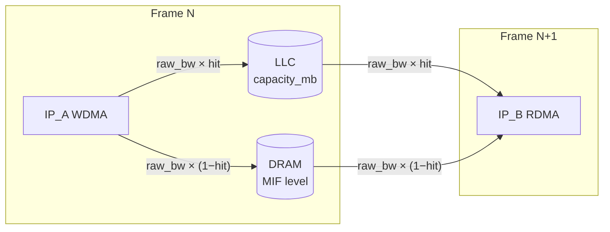

# LLC (Last Level Cache) 모델링 — 설계

> **구현 완료 (2026-07-18)**: 본 설계 전체 구현. `tests/test_llc.py` 22건 포함
> **286 passed**, ruff 클린. E2E 검증: CSIS.CSIS_WDMA→BYRP.COMP_RD0_RDMA path
> 활성화 시 총 DMA BW 5289.4 → 5005.7 MB/s (283.8 MB/s 절감, hit 0.7),
> 리포트에 LLC Summary 섹션 생성 확인. hw yaml이 리스트 형식이므로 LLC 설정은
> `- llc: {...}` 항목으로 지원 (dict 형식이면 최상위 `llc:` 키).

- **작성일**: 2026-07-18
- **배경**: SoC 과제마다 LLC 용량과 LLC 사용 시 DRAM BW 감소율(평균 hit ratio)이 다르다.
  실제 과제에서는 특정 IP의 output이 **다음 frame의 input**으로 재사용될 때 해당 버퍼를
  LLC에 상주시켜 DRAM BW를 절감한다. Still capture 등 시나리오에 따라 LLC를 쓸 수도,
  안 쓸 수도 있으므로 **시나리오 파일에서 LLC path를 정의**할 수 있어야 한다 (compression과 유사).

## 현재 코드의 문제 (사용자 피드백과 일치)

| # | 문제 | 위치 |
|---|------|------|
| 1 | 리포트 DMA 테이블에 LLC/LLC Hit **컬럼은 있으나** BW 계산에 hit ratio가 전혀 반영 안 됨 | `bw.py` — `llc_hit_ratio`는 표시용으로만 통과 |
| 2 | `llc_weight`는 **전력만** 감쇠, DRAM BW(→MIF 레벨 결정)는 감소 없음 | `calc_port_bw` |
| 3 | 포트 키 불일치: 뷰는 `llc`, 계산은 `llc_enable`을 읽음 → 시나리오에 뭘 써도 한쪽은 무시 | `html_view.py:468` vs `bw.py:66` |
| 4 | LLC 용량/평균 hit ratio를 정의할 곳이 없음 (과제별 속성) | hw_config 스키마 부재 |
| 5 | 시나리오에 "LLC path" 개념이 없어 output→다음 frame input 재사용을 표현 불가 | scenario 스키마 부재 |

## 1. 계산 모델

LLC hit은 DRAM 접근을 대체한다. 포트별:

```
raw_bw   = comp_ratio × fps × W × H × (bitwidth/8) × BPP[fmt] × r_w_rate / 1e6   [MB/s]
hit      = port.llc_hit_ratio → scenario.llc_hit_ratio → hw.llc.default_hit_ratio  (우선순위)

LLC 활성 포트:
  dram_bw  = raw_bw × (1 − hit)          ← 'bw_mbs' (DRAM 유효 BW)
  llc_bw   = raw_bw × hit
  bw_power = dram_bw × bw_power_coeff/1000 + llc_bw × llc_power_coeff/1000

LLC 비활성 포트: 기존과 동일 (dram_bw = raw_bw)
```

- **`bw_mbs` 필드의 의미를 "DRAM 유효 BW"로 정의** → 총 BW 합산, **MIF 레벨 결정**,
  BW 차트, 전력 합산 등 모든 기존 소비처가 **수정 없이 LLC 절감을 자동 반영**한다.
- 표시용으로 `raw_bw_mbs`, `llc_bw_mbs` 필드 추가.
- LLC 자체 접근 전력은 `llc_power_coeff` (mW/GB/s, DRAM `bw_power`보다 작음)로 모델링.
- **하위호환**: hit ratio가 어디에도 없고 `llc_weight`만 있으면 기존식
  (`raw_bw × coeff × weight`) 유지. hit ratio가 있으면 새 모델 우선.



## 2. 스키마

### 2.1 HW config (과제별 고정 속성) — `hw_config/*_hw.yaml` 최상위

```yaml
llc:
  capacity_mb: 8            # 과제 LLC 용량 [MB]
  default_hit_ratio: 0.7    # LLC path 사용 시 평균 DRAM BW 감소율 (과제별 평균값)
  power_coeff: 8            # LLC 접근 전력 계수 [mW/GB/s] (DRAM bw_power 대비 소)
```

### 2.2 Scenario 전역 파라미터 (선택 오버라이드)

```yaml
llc_hit_ratio: 0.65   # HW 기본값 오버라이드 (시나리오 특성 반영)
llc_power: 8          # LLC 전력 계수 오버라이드
```

### 2.3 Scenario LLC path 정의 (핵심 신규 기능)

시나리오 최상위 `llc_paths` — 상황(Recording은 사용 / Still capture는 미사용 등)에 따라
시나리오 단위로 켜고 끈다:

```yaml
llc_paths:
  # 형식 1: 단일 포트 지정 — 해당 버퍼가 LLC 상주
  - port: "MTNR0.WDMA1"
    hit_ratio: 0.65          # 선택 (생략 시 전역/HW 기본값)

  # 형식 2: producer → (다음 frame) consumer 경로 지정 — 양쪽 포트 모두 적용
  - from: "YUVP.WDMA0"
    to: "MTNR1.RDMA2"
```

- 해석 규칙: `HW.PORT` → 해당 HW에 매핑된 태스크의 ip_settings inputs/outputs에서 포트 매칭
  → `llc_enable: enable` + `llc_hit_ratio` 주입. 미매칭 시 sanity check 에러 (fix 힌트 포함).
- **포트 직접 지정도 계속 지원**: `llc: enable` 또는 `llc_enable: enable` (+ `llc_hit_ratio`)
  — 로더가 `llc` → `llc_enable`로 정규화해 키 불일치(#3) 해소.
- Exploration의 `llc_enable` feature sweep은 기존 그대로 동작 (새 모델의 혜택을 받음).

### 2.4 CSV → YAML 생성기

ports CSV에 `llc`, `llc_hit_ratio` 컬럼(선택) 추가 지원 → `_build_port_dict` 통과.

## 3. 용량 검증

LLC 상주 버퍼 footprint 합 vs 용량:

```
footprint(port) = W × H × (bitwidth/8) × BPP[fmt] × comp_ratio   [bytes]
Σ footprint(LLC output ports) > capacity_mb → 경고 (hit ratio 하향 권고 메시지)
```

- output 포트만 합산(버퍼 상주 주체). 초과 시 시뮬레이션은 계속 진행하되 경고 + 리포트 표기.

## 4. 리포트 / 뷰

- DMA 테이블: 기존 LLC/LLC Hit 컬럼이 실계산과 일치하게 됨. BW 컬럼 = DRAM 유효 BW.
- **LLC Summary** 블록 신설 (LLC path가 하나라도 있을 때): 용량/사용량, path 목록,
  DRAM BW 절감량(raw−dram), LLC 전력.
- MIF 레벨: DRAM 유효 BW 기반으로 자동 하향 → LLC의 핵심 효과가 리포트에 반영.
- html_view Level2: 기존 LLC 색상 로직의 키 불일치 수정 (`llc_enable` 정규 키 사용).

## 5. 구현 범위

| 파일 | 변경 |
|------|------|
| `src/model/bw.py` | hit ratio 모델, `llc_enabled()` 헬퍼, raw/llc/dram 필드 |
| `src/model/scenario.py` | `_llc_config`, `_llc_power_coeff`, `_llc_default_hit_ratio` 필드 |
| `main.py` | hw yaml `llc:` 파싱, scenario 전역 오버라이드, `llc_paths` 해석·주입, 용량 검증(sanity) |
| `src/view/report_generator.py` | llc 파라미터 전달, LLC Summary 섹션 |
| `src/view/visualizer.py` | llc 파라미터 전달 (BW 차트 = DRAM 유효 BW) |
| `src/controller/exploration.py` | llc 파라미터 전달 |
| `src/view/html_view.py` | 포트 키 정규화 반영 |
| `src/model/csv_to_scenario.py` | llc 컬럼 통과 |
| `hw_config/projectA_hw.yaml` | `llc:` 섹션 추가 (path 미정의 시 동작 무변화) |
| `scenario_config/*` | llc_paths 주석 예시 |
| `tests/test_llc.py` | 계산/경로해석/정규화/용량경고/MIF 영향 회귀 테스트 |

기본값: `llc_power_coeff=8.0`, `default_hit_ratio=0.0`(미설정 시 — LLC enable해도 효과 0 + 경고).
hw/시나리오 어디에도 LLC 설정이 없으면 **기존 결과와 완전 동일** (무영향 보장).
